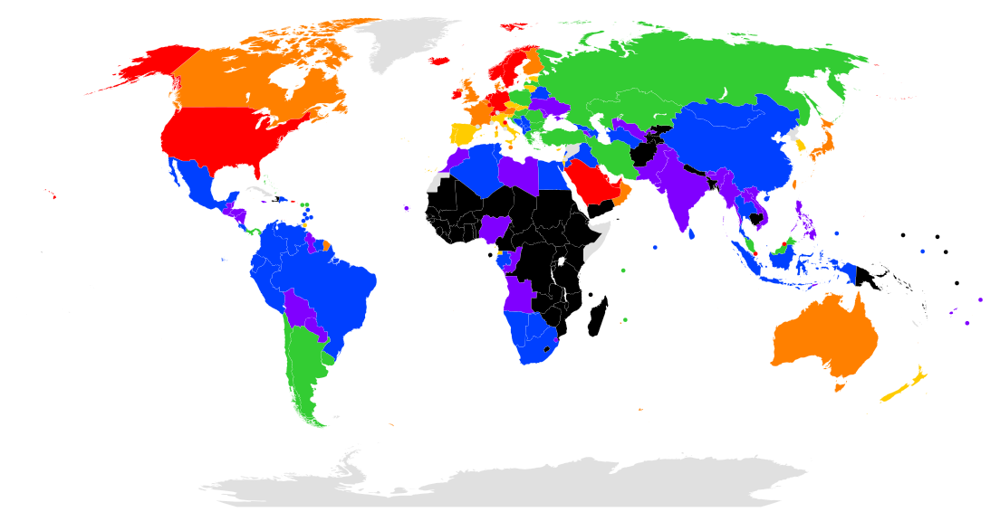

# bear-small-apps
Small Apps Collection


Within WorldMapGenerator, add rule of generating a HashMap of <Country,Color>, then you can get a colorful world map.

Example:

```java

public static void  addToMap() throws Exception {

		List<String> list = Files.readAllLines(Paths.get("world-map-generator/List.file"));

		for (String s : list) {
			String[] arr = s.split("\t");
			int gdp = Integer.parseInt(arr[1].replaceAll(",", ""));
			String country = arr[0].trim();

			if (country.equals("USA") || country.contains("United States"))
				country = "United States of America";

			else if (country.equals("UK"))
				country = "United Kingdom";

			else if (country.contains("Czech"))
				country = "Czechia";

			else if (country.contains("Congo") && !country.contains("Dem"))
				country = "Republic of the Congo";

			else if (country.contains("Congo") && country.contains("Dem"))
				country = "Democratic Republic of the Congo";

			if (gdp > 50000) {
				map.put(arr[0].trim(), "#ff0000");// RED
			} else if (gdp > 40000) {
				map.put(arr[0].trim(), "#ff8000");// ORANGE
			} else if (gdp > 30000) {
				map.put(arr[0].trim(), "#ffff00");// YELLOW
			} else if (gdp > 20000) {
				map.put(arr[0].trim(), "#00ff00");// GREEN
			} else if (gdp > 10000) {
				map.put(arr[0].trim(), "#0080ff");// BLUE
			} else if (gdp > 5000) {
				map.put(arr[0].trim(), "#8000ff");// PURPLE
			} else {
				map.put(arr[0].trim(), "#000000");// BLACK
			}
		}
	}
  
 ```

List Of Countries GDP Per Capital

[List.file](world-map-generator/List.file)

Qatar	124,927\n
Macau	114,430\n
Luxembourg	109,192\n
Singapore	90,531\n
Brunei	76,743\n
Ireland	72,632\n
Norway	70,590\n
...



